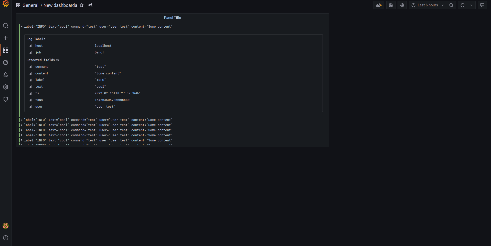

# Deno-Loki

a simple to use [Loki](https://grafana.com/oss/loki/) logger for deno

```ts
import { LokiLogger } from 'https://deno.land/x/loki/mod.ts';
let logger = new LokiLogger(
	'http://localhost:3100',
	1,
	{
		host: 'localhost',
		job: 'Deno!',
	},
	'TEXT'
);
logger.info('Some info', { data: 'Some more info' });
logger.warm('Some info', { data: 'Some more info' });
logger.debug('Some info', { data: 'Some more info' });
logger.error('Some info', { data: 'Some more info' });
```


